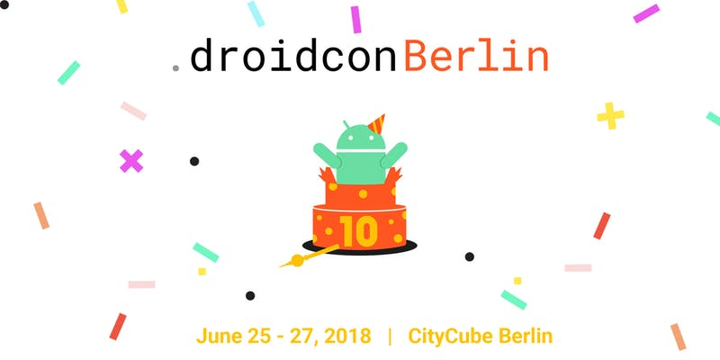

# Day One at Droidcon Berlin 2018

The first day of [Droidcon Berlin](http://droidcon.de) is traditionally an interactive day. In previous years it was a full day [barcamp](http://barcamp.org). This year there will be a mix of workshops, panel discussions, and your sessions.

Bring your topics, stories, bugs, apps and laptop!

To make the day more sustainable, this booklet contains summaries, links, and resources about the sessions.

Thank you to all contributors! See the list at [Github](https://github.com/droidcon/gitbook-2018-berlin-barcamp/network/members).

Read the [booklet from 2015](https://droidcon.gitbook.io/2015-berlin-barcamp),   
[from 2016](https://droidcon.gitbook.io/2016-berlin-barcamp),  
and [from 2017](https://droidcon.gitbook.io/2017-berlin-barcamp)

